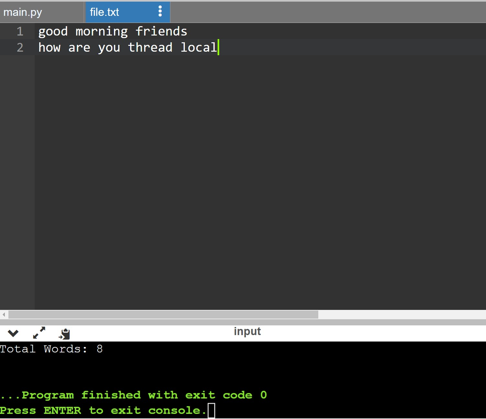

# Word-count
## AIM:
To write a python program for getting the word count from a text.
## EQUIPEMENT'S REQUIRED: 
PC
Anaconda - Python 3.7
## ALGORITHM: 
### Step 1:
Create a file and add some content into it.

### Step 2:
Open file using with keyword/built-in function in read mode.

### Step 3:
Use read() to read the contents of the file.

### Step 4:
Split the lines using split().

### Step 5:
Iterate the list and increment the count

### Step 6:
Print the output.


## PROGRAM:
```
file = open('file.txt', 'r')
read_data = file.read()
per_word = read_data.split()

print('Total Words:', len(per_word))
```
### OUTPUT:



## RESULT:
Thus the program is written to find the word count from a text.
